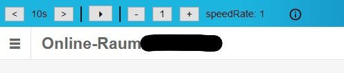
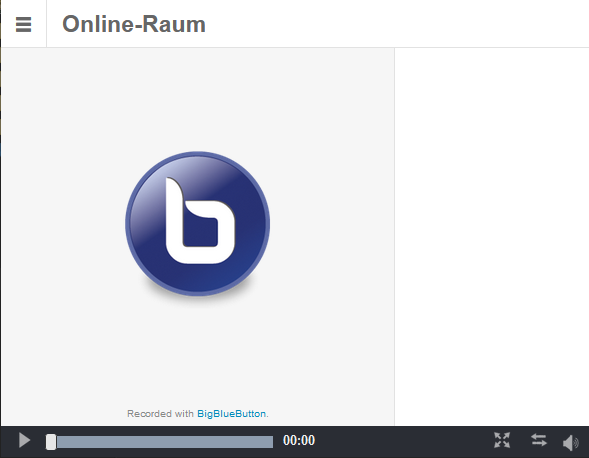
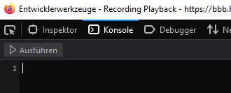

# bbb JS Plug-in

Adds a toolbar to the bbb player. Works only in the playback function of bbb (e.g. URLs like "bbb.example.com/playback/...").

## Shortcuts
Key | 2nd | action
--- | --- | ---
`k` | `arrow left` | back
`l` | `arrow right` | fwd
`n` | `arrow down` | slower (about videoSpeedRateStepSize)
`m` | `arrow up` | faster (about videoSpeedRateStepSize)
`space` |  | play/pause

---

## Installation (Firefox)

> I tested the script only with Firefox.

Open your bbb video and wait until it is ready to watch.

Press F12 to open the developer tools and then navigate to Console.

Paste the script and run it with ctrl+Enter. The toolbar should now appear at the top of the page. The developer tools window can now be closed.
